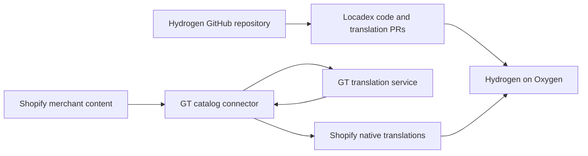

# GT + Hydrogen integration recipe

This is the reference integration for the original `kevinwu98/gt-shopify` POC.
It separates the integration a developer can run locally from the hosted merchant
experience GT would still need to build. The separate `gt-shopify-public` starter
is unchanged.

## The architecture

Locadex can be the entry point for setup and code automation. `gt-react` renders
translated application copy and formats values. A separate catalog connector
uses GT to translate merchant content and saves the results in Shopify.

In this design, Shopify stores GT's catalog translations; Translate & Adapt does
not generate them. Shopify exposes merchant translation APIs for this purpose.
Using that storage lets the catalog remain independent of a storefront release.
See [Shopify's translated-content guide](https://shopify.dev/docs/apps/build/markets/manage-translated-content).

## 1. Establish the English baseline

Start from the official Hydrogen starter, connect the intended Shopify store,
and deploy to Oxygen. Confirm product browsing, variants, search, cart updates,
and checkout handoff before adding GT. Commit the baseline so integration changes
are reviewable. Keep credentials outside Git.

This reference uses Hydrogen 2026.4.5, React Router 7.16.0, React 18, `gt-react`
11.4.3, and Shopify API version 2026-04. Another version needs its own validation.
See [OXYGEN.md](OXYGEN.md) for this POC's deployment workflow.

## 2. Install UI localization with Locadex

Use the existing [Locadex dashboard flow](https://generaltranslation.com/docs/platform/locadex/quickstart):

1. Open a GT project and connect the GitHub repository under Integrations → Catalog.
2. Create Generate code, choose repository root `.` and React Router, and select
   the target branch.
3. Run setup with English as the source and French/Japanese as targets.
4. Review and merge the setup PR. Run code generation for the storefront's UI.
5. Configure Generate translations and push for source changes. Review generated
   PRs before deploying. Keep locales in sync when changing the language list.

[LOCADEX.md](LOCADEX.md) records the actual project, PRs, and automations used
here. This integration also required manual Hydrogen-specific corrections; the
generic React Router setup alone is not evidence of a finished Hydrogen adapter.

## 3. Review the Hydrogen runtime contract

The reusable recipe must preserve these properties:

- Resolve one request language for GT's server-rendered UI, `<html lang>`, and
  Hydrogen's catalog queries. Hydration must begin with the same language and
  translations; a module-global mutable request locale would mix shoppers.
- Place `GTProvider` around the document layout, including route errors. Preserve
  Hydrogen's streaming renderer, nonce handling, and React Router integration.
- Localize authored text with GT. Keep IDs, URLs, analytics values, option values
  used for variant selection, and cart mutation payloads intact.
- Preserve the cart/session while changing language. Verify search results,
  optimistic cart states, and repeated requests in different languages.
- Format Shopify's money amount and currency code with `gt-react`'s `Currency`.
  Formatting changes presentation; it does not convert prices.

Language and country are separate inputs. A French-speaking shopper can shop the
US market in USD. A market change must also align prices and cart buyer context;
it must not follow implicitly from choosing French or Japanese. This reference
retains the US country context. Shopify documents this distinction in its
[Hydrogen Markets guidance](https://shopify.dev/docs/storefronts/headless/hydrogen/markets).

## 4. Translate the catalog through Shopify

The earlier [bundled dictionary demo](CATALOG.md) provides the `gt-react` display
path for translated product data, but requires rebuilding the storefront after
catalog changes. Use the [local native-storage connector](SHOPIFY-CATALOG.md)
for the scalable delivery path:

1. Obtain a Shopify Admin credential for the connector with the documented
   translation permissions. The storefront token is a different credential.
2. Export supported English fields and Shopify's source-content digests.
3. Run GT translation locally with your GT API key, then review the results.
4. Inspect the connector's write plan. Apply supported translations to Shopify,
   rechecking source digests and protecting existing merchant edits.
5. Enable/publish the intended Shopify languages and configure their markets.
   Set `GT_CATALOG_DELIVERY=shopify` in the storefront environment only after this
   setup. GT UI translation and money formatting continue in either mode.

The local commands are `npm run shopify-catalog:export`, `:translate`, `:plan`,
`:apply`, and `:status` (each with the `shopify-catalog` prefix). Follow the
[connector guide](SHOPIFY-CATALOG.md) for credentials, supported fields, and the
reviewed plan hash required by apply. Keep the connector's Admin/GT credentials
out of the storefront environment and browser bundles.

The local connector is a reference implementation, not a Shopify connection
already available in the GT dashboard. It does not install a hosted app, register
background jobs, or grant itself access to a store. Actual GT translation and
Shopify writes require the user's local credentials and execution.

## 5. Prove repeatability and continuing updates

Record the source commit, generated PR, connector plan, and Oxygen deployment
for each check. A successful build or translated language selector is insufficient.

| Proof | Passing behavior |
| --- | --- |
| First page request | Actual French/Japanese UI and catalog values in initial HTML; correct document language; clean hydration |
| Commerce | The same product/variant and cart quantities survive language switches; prices and charged currency remain consistent |
| Repository change | A new English UI feature produces reviewable Locadex changes and translated Oxygen output |
| Catalog change | A Shopify product edit receives a GT translation through the connector and appears after cache refresh **without a new storefront build** |
| Repeated run | Already-current translations are not retransmitted; stale sources and manual edits are handled explicitly |
| Second storefront | A fresh official starter and second store work using this recipe, without copying hidden configuration or requiring bespoke fixes |

Run the repository's lint, typecheck, unit tests, production build, and deployment
checks. Native catalog verification must compare against Shopify's applied
translations; the bundled-dictionary coverage check alone cannot prove native
delivery. Record both successful and unsupported cases.

## Production boundaries

The local proof does not establish continuous hosted synchronization or full-store
coverage. A merchant product still needs Shopify authorization/install flow,
durable work queues, retries, reconciliation, review controls, observability,
tenant isolation, and a tested coverage matrix.

Verify rich descriptions, collections, navigation, pages, eligible metafields,
SEO fields, and every requested content type before promising the entire
storefront. Localized search behavior, Shopify-hosted checkout, customer accounts,
notifications, and third-party apps need separate checks. Shopify's translation
API has resource-specific limits; it does not translate arbitrary application data.

The current cookie-based language selector is useful for the demo. A production
multilingual SEO rollout should add explicit locale URLs, canonical/hreflang
behavior, and sitemap checks. Shopify recommends separate URLs for each locale;
the presence of translated HTML alone does not complete that work.
